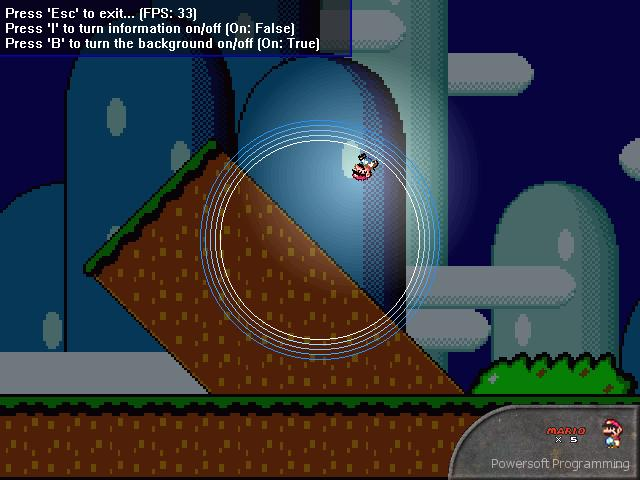



## Direct3D \-\> 2D Part 3, Alpha blending\!\!\!

### Description

I'm back, with Part 3 of creating 2D graphics using Direct3D.  

Part 3 is built on top of Part 1, still displaying the Mario character running around in circles, but contains some additions which I just found out:  

<ul>

<li>Alpha blending! (you can change the alpha value, as shown in the demo)

<li>Faster way of faking light! (this time, not using vertex color, but simply drawing a bitmap alpha-blended over the scene, more accurately simulating lighting)

<li>Using DirectDraw in combination with Direct3D! (allowing for large surfaces to be drawn, like the background)

</ul> 

The 33 FPS in the screenshot are from my P133, however, if I turn off the background it instantly goes to 60 FPS (the maximum, since that's my monitor's refresh rate)...  

Enjoy! And don't forget to leave comments (and vote!)
 
### More Info
 

             |
---                |---
**Submitted On**   |2001-03-06 21:00:20
**By**             |[Mark van Renswoude](https://github.com/Planet-Source-Code/PSCIndex/blob/master/ByAuthor/mark-van-renswoude.md)
**Level**          |Intermediate
**User Rating**    |4.8 (29 globes from 6 users)
**Compatibility**  |VB 4\.0 \(32\-bit\), VB 5\.0, VB 6\.0
**Category**       |[DirectX](https://github.com/Planet-Source-Code/PSCIndex/blob/master/ByCategory/directx__1-44.md)
**World**          |[Visual Basic](https://github.com/Planet-Source-Code/PSCIndex/blob/master/ByWorld/visual-basic.md)
**Archive File**   |[CODE\_UPLOAD16103362001\.zip](https://github.com/Planet-Source-Code/mark-van-renswoude-direct3d-2d-part-3-alpha-blending__1-21554/archive/master.zip)

